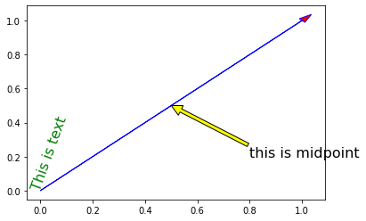
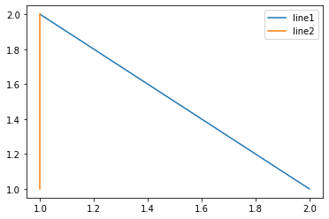

# 第三章：布局格式定方圆

这一章我们主要来讲布局，主要来介绍子图的绘制

## 一. 子图

1. 使用plt.subplots绘制均匀状态下的子图

   plt.subplots能够返回两个参数，画布和子图构成的列表。

   其中sharex和sharey分别代表是否共享子图的横纵坐标。

   Fig.tight_layout函数用于调整子图的相对大小使得子图尽量不重叠

   ```python
   import matplotlib.pyplot as plt
   import numpy as np
   fig, axs = plt.subplots(2, 5, figsize=(10, 4), sharex=True, sharey=True)
   for i in range(2):
       for j in range(5):
           axs[i][j].scatter(np.random.randn(10), np.random.randn(10))
           axs[i][j].set_title(f'row:{i+1}, column:{j+1}')
           axs[i][j].set_xlim(-5, 5)
           axs[i][j].set_ylim(-5, 5)
           if i==1:
               axs[i][j].set_xlabel('horizontal axis')
           if j==1: 
               axs[i][j].set_ylabel('vertical axis')
   fig.tight_layout()
   plt.show()
   ```

   

   

2. 使用GridSpec绘制非均匀子图

   废话不多说，先上图：

   

   我们可以使用add_gridspec指定宽度比例width_ratios和高度比例height_ratios。其余的代码都和上面类似

   ```python
   # create figure
   fig = plt.figure(figsize=(10, 4))
   spec = fig.add_gridspec(nrows=2, ncols=5, width_ratios=[1,2,3,4,5], height_ratios=[1,3])
   fig.suptitle('Sample2', size=20)
   # plot
   for i in range(2):
       for j in range(5):
           ax = fig.add_subplot(spec[i, j])
           ax.scatter(np.random.randn(10), np.random.randn(10))
           if i==1:ax.set_xlabel('x')
           if j==1:ax.set_ylabel('y')
   fig.tight_layout()
   plt.show()
   ```

   上面的例子中使用了了spec[i, j]的用法，事实上通过把spec看作一个列表，对spec进行切片就可以实现子图的合并从而达到跨图的功能：

   ```python
   fig = plt.figure(figsize=(10, 4))
   spec = fig.add_gridspec(nrows=2, ncols=6, width_ratios=[2,2.5,3,1,1.5,2], height_ratios=[1,2])
   fig.suptitle('Sample3', size=20)
   # sub1
   ax = fig.add_subplot(spec[0, :3])
   ax.scatter(np.random.randn(10), np.random.randn(10))
   # sub2
   ax = fig.add_subplot(spec[0, 3:5])
   ax.scatter(np.random.randn(10), np.random.randn(10))
   # sub3
   ax = fig.add_subplot(spec[:, 5])
   ax.scatter(np.random.randn(10), np.random.randn(10))
   # sub4
   ax = fig.add_subplot(spec[1, 0])
   ax.scatter(np.random.randn(10), np.random.randn(10))
   # sub5
   ax = fig.add_subplot(spec[1, 1:5])
   ax.scatter(np.random.randn(10), np.random.randn(10))
   fig.tight_layout()
   ```

   

## 二. 子图上的方法

在定义了子图之后，我们就可以在ax对象上定义的各种方法来绘制函数了，常用的有plot, hist, scatter, bar, varh, pie等，在上一节课中已经详细地定义过了。

这里我们补充几种快速绘制直线的方法，分别是

- ax.axhline(a, b, c)在(a,b)点绘制到x=c位置的水平线
- ax.axvline(a, b, c)在(a,b)点绘制到y=c位置的垂直线
- ax.axline()绘制任意直线

其中括号内全部输入坐标即可生成对应的线，如图：

```python
fig, ax = plt.subplots(figsize=(4,3))
ax.axhline(0.5,0.2,0.8)
ax.axvline(0.5,0.2,0.8)
ax.axline([0.3,0.3],[0.7,0.7]);
```

使用 `set_xscale, set_title, set_xlabel` 分别可以设置坐标轴的规度（指对数坐标等）、标题、轴名。

与一般的 `plt` 方法类似， `legend, annotate, arrow, text` 对象也可以进行相应的绘制。

```python
fig, ax = plt.subplots()
#draw vector
ax.arrow(0, 0, 1, 1, head_width=0.03, head_length=0.05, facecolor='red', edgecolor='blue')
#add text
ax.text(x=0, y=0,s='This is text', fontsize=16, rotation=70, rotation_mode='anchor', color='green')
#add annotate
ax.annotate('this is midpoint', xy=(0.5, 0.5), xytext=(0.8, 0.2), arrowprops=dict(facecolor='yellow', edgecolor='black'), fontsize=16);
```



最后我们再来学一下legend的布局怎么写，很多时候这个legend的布局会让人很头疼

```python
fig, ax = plt.subplots()
ax.plot([1,2],[2,1],label="line1")
ax.plot([1,1],[1,2],label="line1")
ax.legend(loc=1);
```



其中，图例的 `loc` 参数如下，一般我们都喜欢直接设成0：

| string       | code |
| ------------ | ---- |
| best         | 0    |
| upper right  | 1    |
| upper left   | 2    |
| lower left   | 3    |
| lower right  | 4    |
| right        | 5    |
| center left  | 6    |
| center right | 7    |
| lower center | 8    |
| upper center | 9    |
| center       | 10   |