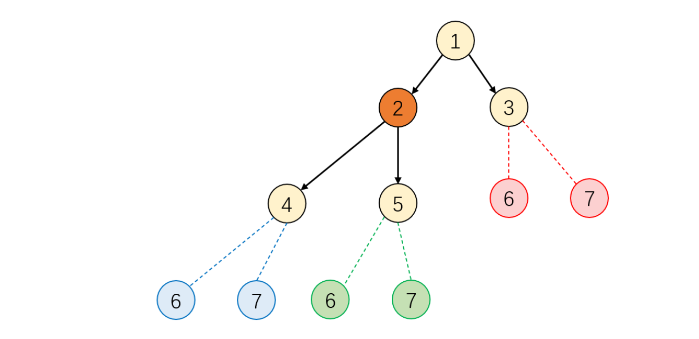

# Chapter1 Decision Tree

1. Foundation for information theory（信息论基础）

   我们回忆一下树的基本结构。树具有分支结构，每个叶节点代表样本的集合。我们能够通过树的分支功能对类别进行划分，从而来完成分类问题。那么划分的标准在哪呢？我们认为，划分后的集合，子节点中类别纯度的加和应当高于父节点的纯度，从而使得分出的新类别纯度较高，起到分类的作用。

   那么纯度该怎么定义呢？最简单的想法是使用不确定性，如果在样本空间里，所有样本出现的不确定性都一样，那么我们认为这个样本空间是混沌的，不确定性较高，纯度也较低。当一个节点中某一样本出现的概率较高，那么我们就比较有把握掌握将要出现的样本，即纯度较高。

   根据上面的想法我们来构建一个用于衡量不确定性的可微函数 $I(p),p\in[0,1]$ 来表示时间A发生概率 $p(A)$ 所表达的不确定性。那么直觉上我们应该需要满足以下三个条件，我们将其称为信息量公理。其中 $A_1, \dots,A_n$ 为独立事件。

   - $I(1)=0$ （当事件发生概率为1时，不确定性为0）
   - $I(p)$关于$p$单调递减  （事件发生的概率越低，不确定性越高）
   - $I(\prod_{i=1}^{n}p(A_i))=\sum_{i=1}^{n}I(p(A_i))$  （发生多个事件不确定性等于这多个事件各自的不确定性相加）

   可以看出这三条公理还是非常直观好理解的。那么根据这个公理，我们来寻找可以表达这三条公理的函数。容易想到：
   $$
   I(p)=alog_b(p)(a(b-1)<0)
   $$
   事实上它也是满足这三条公理的唯一函数。

   *Theorem 1*: The function $I(p)$ can be expressed as follows if and only if the above three conditions hold
   $$
   I(p)=alog_b(p)(a(b-1)<0)
   $$
   Proof:之后补

   然后我们来确定参数a, b。比如当样本空间里有$\frac{1}{p}$个事件，所有事件发生的概率为 $p$ 时，根据二进制编码此时事件发生的不确定性为 $-log_2\frac{1}{p}$ ，此时我们取 $b=2,a=-1$ 即可，这样我们用来衡量不确定性的指标就构建完成了。这就是大名鼎鼎的信息学单位熵的由来。
   $$
   I(p) = -log_2(p)
   $$
   之前是假设所有事件发生的概率相同，我们得出了如上结果，那么我们进一步思考，这次我们让所有的时间服从一个离散分布 $p=[p_1,\dots,p_n]^T$ ，$p_n$表示第$n$个事件发生的概率。那么如何定义表示所有时间的不确定性函数$H(\bold{p})$，即 $H(p_1,\dots,p_n)$ 呢？

   我们不难想到直接求期望即可（等价于计算每个事件的不确定性然后用他们发生的概率进行加权）
   $$
   H(Y) = E_Y[I(p)] = E_{Y\sim p(y)}[-log_2p(Y)]
   $$

   $$
   H(p1,\dots,p_n)=-C\sum_{i=1}^{n}p_ilogp_i
   $$

   同样在以下的构造条件下，该$H(\bold{p})$也是唯一形式：

   - H关于$p_i$连续。

   - 若$p_1 = \dots = p_n$，则H关于$n$单调递增。  （实际上就是定理1的条件，概率相同，事件数量n越多，不确定性越高）

   - 若将某个$p_i$拆分为$p_{i1}$和$p_{i2}$，则
     $$
     H(p_1,\dots,p_{i-1},p_{i1},p_{i2},p_{i+1},\dots,p_n) = H(p_1,\dots,p_{i-1},p_{i+1},\dots,p_n)+p_iH(\frac{p_{i1}}{p_i},\frac{p_{i2}}{p_i})
     $$
     这个需要解释一下，如果我们将其中的一个事件拆分成了两个，那么不确定性（纯度）的变化应该和一下两种因素相关

     - 拆分节点的纯度$p_i$：若拆分节点本身纯度高，那么高纯度的节点被拆分了，理所应当系统纯度下降的幅度应当比拆分低纯度的节点要大
     - 拆分出的节点各自的纯度$H(\frac{p_{i1}}{p_i},\frac{p_{i2}}{p_i})$：若拆分出了高纯度的子节点，纯度的下降幅度应该会相对拆分出低纯度的子节点要小

   *Theorem 2*: The function $I(p)$ can be expressed as follows if and only if the above three conditions hold
   $$
   H(p1,\dots,p_n)=-C\sum_{i=1}^{n}p_ilogp_i
   $$
   Proof:见香农论文Appendix2

   有了函数，我们来研究一下函数最大最小值：

   *Theorem 3*: The function $I(p)$ reaches maximum $log(N)$ when each random variable distribute uniformly ($i.e:p_1=\dots=p_n=\frac{1}{n}$) and reaches minimum $0$ when it is one-point distribution $(i.e:p=1)$ 

   Proof: 之后补

   幸运的是，这些结论和直觉都是高度重合的。比如如果在节点中每个节点的分布都均匀，那么不确定性就最大，如果节点中只有一个100%发生的事件，那么不确定性就为0.

   我们定义完了衡量不确定性的指标，回到决策树上来看。在决策树的分裂过程中，我们不但需要考虑本节点的不确定性或纯度，我们同样需要考虑分裂后的节点的平均不确定性或纯度。子节点的分裂是在基于分裂的条件之后，因此我们很自然的想研究：在给定条件下，随机变量的平均信息熵，我们把它称作是条件熵(Conditional Entropy)。我们用tower property/law of total expectation的类比来定义这个条件熵，注意这只是类比，因为我目前也没办法给出严格的证明：
   $$
   Tower\ rules:E[Y] = E[E[Y|X]]
   $$

   $$
   H(Y) = E_Y[I(p)]=E_X[E_{Y|X}[-log_2p(Y|X)]]
   $$

   我们可以从形式上来直观理解，$y|x$ 指在某个子节点（x）的分裂下的取值，我们先求 $E_{Y|X}$ 求出某个分裂方式下的期望，再对所有的分裂情况求期望 $E_X$ 即可得到最后的结果。

   对于离散条件熵，设随机变量$X$的取值空间为${x_1,\dots,x_M}$, 把条件熵展开后可以写成：
   $$
   -\sum_{m=1}^{M}p(x_m)\sum_{k=1}^{K}p(y_k|X=x_m)log_2p(y_k|X=x_m)
   $$
   定义完了条件熵，我们就能很自然地定义信息增益（information gain），即节点分裂之后带来了多少不确定性的降低或者纯度的提高。在得到了随机变量（分裂方式）X的取值信息之后，随机变量$Y$的不确定性的平均减少量为
   $$
   G(Y,X)=H(Y)-H(Y|X)
   $$
   直观观察来看，在给定一个限定的假设空间$X$的情况下，$H(Y)$是一定大于$H(Y|X)$的。这个我们将之前求得的条件熵展开公式代入即可很容易的证明。
   $$
   G(Y,X)=E_Y[-log_2p(Y)]-E_X[E_{Y|X}[-log_2p(Y|X)]]\\ 
   =-\sum_{k=1}^{K}\sum_{m=1}^{M}p(y_k,x_m)log_2{\frac{p(y_k)p(x_m)}{p(y_k,x_m)}}
   $$
   根据上式可以发现，信息增益实际上就是$p(y,x)$关于$p(y)p(x)$的KL散度，而KL散度的非负性由Jensen不等式可以证明。这里不重点证明它的非负性，我们主要需要用上式来得出信息增益的一般表达形式。

   用信息增益的大小来进行决策树的节点分裂时，由于真实的分布函数未知，故用 $p(Y)$ 的经验分布（即频率）$p(y|x)$ 来进行概率的估计。若节点每个分支下的样本数量为 $D_1,\cdots,D_M$ ，记 $\widetilde{p}(x_m)=\frac{D_m}{\sum_{m'=1}^{M}D_{m'}}$，$\widetilde{p}(y_k)$ 和 $\widetilde{p}(y_k|x_m)$ 分别为节点中第k个类别的样本占节点总样本的比例和第m个子节点中第k个类别的样本数量占该子节点总样本的比例。

   *Definition 2*: The information gain of spliting the N th node is defined as:
   $$
   G_N(Y,X)=-\sum_{i=1}^{K}\widetilde{p}(y_k)log_2\widetilde{p}(y_k)+\sum_{m=1}^{M}\widetilde{p}(x_m)\sum_{k=1}^{K}\widetilde{p}(y_k|x_m)log_2\widetilde{p}(y_k|x_m)
   $$
   这样我们就完成了信息增益的定义。我们知道了如何评判分类结果所包含的信息量纯度，下一步我们就来思考如何有效地设置分裂标准

2. Spliting Criterion (ID3, C4.5 algorithm)（决策树的分裂策略）

   在决定如何对每个节点进行分裂时，我们往往会抽取max_features个特征进行遍历（数据量小的话max_features就是features数量），然后我们选取其中信息增益最大的划分方式进行分裂。根据特征的不同类别我们可以分成三种情况进行讨论：类别特征， 数值特征和含缺失值的特征。

   对于类别特征，常用做法是给定一个阈值$\epsilon$ ，树的每一个节点会选择最大信息增益$G_N^{max}(Y,X)$对应的特征进行分裂，直到所有节点相对的最大信息增益$\frac{D_N}{D_{all}}G_N^{max}(Y,X)$ 小于$\epsilon$ ，$D_N$和$D_{all}$分别指节点的样本个数和整个数据集的样本个数。这种生成方式被称为经典的ID3算法。注意这个阈值在sklearn中参数名为min_impurity_decrease，默认取0。

   为了处理后两种类型的特征，C4.5算法在ID3算法的基础上又做了诸多改进。这里主要介绍以下三种改进：处理数值特征，处理含缺失值的特征，使用信息增益比代替信息增益，以及给出树的剪枝策略。

   对于数值特征，可以用两种方法来将数值特征通过分割来转换成类别特征。他们分别是最佳分割法和随机分割法，分别对应Sklearn中splitter参数的best和random选项。

   在随机分割法下，我们令$s\sim U[x_{min},x_{max}]$ ，其中$U[x_{min},x_{max}]$ 代表在特征最小值和最大值区间的均匀分布，将每个节点中特征x以s为界限左右划分成两个集合，通过这种方式来把数值变量转换成类别变量。此时根据这两个类别来计算树节点分裂的信息增益，并将它作为这个数值分裂的信息增益。

   在最佳分割法下，我们依次令s取遍所有 $x_i(i=1,\cdots,D_N)$，将其作为分割点，按照特征$x$中的元素是否超过$s$把样本划分为两个集合，计算所有s分割下产生的最大的信息增益值，取其中的最大值作为最终的分裂节点。

   对于缺失数据，C4.5算法处理的思路也非常简单。我们这样设计：在某个节点，样本的缺失值占比越大，相比其它样本个数相同，但是无缺失值的节点，进行分裂后的信息增益就应该越小，因为缺失值本身就是一种信息的不确定，因此我们应该对这种情况的信息增益进行惩罚。我们通过加权重进行惩罚，缺失值越多，对信息增益的惩罚就越大：设节点N的样本缺失值比例为$\gamma$ ，非缺失值对应的类别标签和特征分别为 $\tilde{Y}$ 和 $\tilde{X}$ ，则修正后的信息增益为：
   $$
   \tilde{G}(Y,X)=(1-\gamma)G(\tilde{Y},\tilde{X})
   $$
   当数据完全缺失时 $\gamma =1$ ，信息增益无论怎么分都为0，当数据没有缺失时，信息增益与原来保持一致。

   然后我们额外介绍一下C4.5算法的另一重改进，我们使用了信息增益比来替代信息增益，其原因在于：通过信息增益来分裂的决策树对类别较多的特征具有天然的倾向性。例如：当某一个特征（id, 学号）的类别数量恰好就是样本数量时，无论我们怎么切，总能找到一个分裂后的H(Y|X)=0，这样会造成G(Y, X)直接就到了最大值，必定会优先选择此特征进行分裂，但这样的情况显然是非常不合理的。

   我们在第一节部分已经证明了，在类别占比均匀的情况下，类别数越多熵越高，因此我们可以使用特征本身对应的熵来做惩罚，类别本身熵更高的变量会抑制分裂产生的信息增益，由此我们定义信息增益比

   *Definition 3*: The information gain rate is defined as
   $$
   G^R(Y,X)=\frac{G(Y,X)}{H(Y)}
   $$
   在前面我们讨论了树的分裂方式/生长方式，现在我们再来研究一下树的分裂顺序。

   假设我们发现了如下的情景：我们已经处理完了2号节点的分裂，所有的黄色节点都是已存在的节点，现在我们需要决定到底是分裂4，5还是3来生成之后的6，7呢？

   

   在sklearn中提供了两种树的生长模式，他们分别被称为深度优先生长和最佳增益生长，当参数max_leaf_nodes使用默认值None时会使用前者，当它被赋予某个数值后会使用后者。

   深度优先生长采用深度优先搜索的方法: 若当前节点存在未搜索过的子节点，则当前节点跳转到子节点进行分裂决策；若当前节点为叶节点，则调转到上一层节点，直到根节点不存在未搜索过的子节点为止。对上图而言，当前节点为2号，它的两个子节点4号和5号都没有被搜索过，因此下一步则选择两个节点中的一个进行跳转。当决策树使用最佳增益生长时，每次总是选择会带来最大相对信息增益的节点进行分裂，直到叶节点的最大数量达max_left_nodes。

3. CART Tree (Classification and Regression Tree)

   CART Tree是一颗二叉树，它既能够处理分类问题，也能够处理回归问题。值得注意的是，在sklearn中并没有实现处理类别特征和处理缺失值的功能，前者是因为多个类别的特征会产生多叉树，后者是因为sklearn认为用户应当自己决定缺失值的处理，而不是交给模型来决定。

   如何让决策树做到完成回归任务？想法很简单，我们只要让输出的不是类别型而是数值型就行了。CART树会输出该叶节点中所有值的均值，而不是类别。同样，我们的分类目的还是一样的：让不同的子节点之间的差异较大，但每个子节点内部的差异较小。此时，分割策略仍然可以采用随机分割法或最佳分割法，只是现在不再以熵（条件熵）来评价节点（子节点）的纯度。

   我们应当如何定义回归树的节点纯度？对于数值标签而言，我们可以认为节点间元素大小越接近则纯度越高，因此可以考虑使用均方误差（MSE）或平均绝对误差（MAE）来替换熵和条件熵的位置。

   令节点N的样本标签为 $y_1^{(D)},\cdots,y_N^{(D)}$ , 左右子节点的样本个数分别为 $y_1^{(L)},\cdots, y_n^{(L)}$ 和 $y_1^{(R)},\cdots,y_n^{(R)}$。令$\bar{y}^{(D)},\bar{y}^{(L)},\bar{y}^{(R)}$分别为节点N，左子节点，右子节点的样本标签均值，令$\tilde{y}^{(D)},\tilde{y}^{(L)},\tilde{y}^{(R)}$ 为节点N，左子节点，右子节点的样本标签中位数。

   此时两者的信息增益可以分别定义为
   $$
   G^{MSE}(Y,X) = \frac{1}{N}\sum_{i=1}^{N}(y_i^{(D)}-\bar{y}^{(D)})^2-\frac{N_L}{N}\frac{1}{N_L}\sum_{i=1}^{N_L}(y_i^{(L)}-\bar{y}^{(L)})^2-\frac{N_R}{N}\frac{1}{N_R}\sum_{i=1}^{N_R}(y_i^{(R)}-\bar{y}^{(R)})^2\\
   G^{MAE}(Y,X) = \frac{1}{N}\sum_{i=1}^{N}|y_i^{(D)}-\bar{y}^{(D)}|-\frac{N_L}{N}\frac{1}{N_L}\sum_{i=1}^{N_L}|y_i^{(L)}-\bar{y}^{(L)}|-\frac{N_R}{N}\frac{1}{N_R}\sum_{i=1}^{N_R}|y_i^{(R)}-\bar{y}^{(R)}|
   $$
   这样我们就能够通过MSE和MAE让树根据数值型变量来生长了。

   当处理分类问题时，虽然ID3或C4.5定义的熵仍然可以使用，但是由于对数函数的计算代价较大，CART将熵中的log在p=1处利用一阶泰勒展开来降低计算复杂度，基尼系数定义为熵的线性近似，即由于
   $$
   H(Y)=E_YI(p)=E_Y[-log_2p(Y)]\approx E_Y[1-p(Y)]
   $$
   我们定义基尼系数为
   $$
   Gini(Y)=E_Y[1-p(Y)]\\=1-\sum_{k=1}^{K}\tilde{p}^2(y_k)
   $$
   类似地定义条件基尼系数为
   $$
   Gini(Y|X)=E_X[E_{Y|X}[1-p(Y|X)]]\\=\sum_{m=1}^{M}\tilde{p}(x_m)[1-\sum_{k=1}^{K}\tilde{p}^2(y_k|x_m)]
   $$
   从而定义信息增益
   $$
   G(Y,X)=Gini(Y)-Gini(Y|X)
   $$
   我们学会了如何利用CART树处理回归问题，以及通过一阶泰勒近似来降低处理分类问题的时间复杂度。最后我们来看一看如何剪枝，防止过拟合

4. Decision Tree Pruning（决策树的剪枝）

   决策树具有很强的拟合能力，对于任何一个没有特征重复值的数据集，决策树一定能够在训练集上做到分类错误率或均方回归损失为0，因此我们应当通过一些手段来限制树的生长，这些方法被称为决策树树的剪枝方法。其中，预剪枝是指树在判断节点是否分裂的时候就预先通过一些规则来阻止其分裂，后剪枝是指在树的节点已经全部生长完成后，通过一些规则来摘除一些子树。

   在sklearn的CART实现中，一共有6个控制预剪枝策略的参数，它们分别是最大树深度max_depth、节点分裂的最小样本数min_samples_split、叶节点最小样本数min_samples_leaf、节点样本权重和与所有样本权重和之比的最小比min_weight_fraction_leaf、最大叶节点总数max_leaf_nodes以及之前提到的分裂阈值min_impurity_decrease。

   后剪枝过程又称作MCCP过程，即Minimal Cost-Complexity Pruning，它由参数ccp_alpha控制，记其值为。一般而言，树的叶子越多就越复杂，为了抑制树的生长，我们定义以节点为根节点的树的复杂度为该树的叶节点数

   