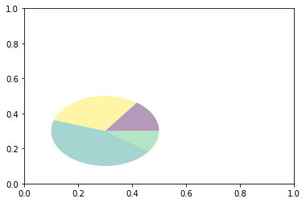
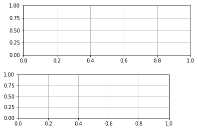

# 第二章：艺术画笔见乾坤

## 一. 概述

1. matplotlib的三层api：

   和我们平常作画的逻辑相似，绘画的过程需要三层准备：画布，颜料画笔，作画，matplotlib对应就有三个层级的api：

   - matplotlib.backend_bases.FigureCanvas` 代表了绘图区，所有的图像都是在绘图区完成的
     `
   - matplotlib.backend_bases.Renderer` 代表了渲染器，可以近似理解为画笔，控制如何在 FigureCanvas 上画图。` 
   - matplotlib.artist.Artist` 代表了具体的图表组件，即调用了Renderer的接口在Canvas上作图。

   前两者处理程序和计算机的底层交互的事项，第三项Artist就是具体的调用接口来做出我们想要的图，比如图形、文本、线条的设定。所以通常来说，我们95%的时间，都是用来和matplotlib.artist.Artist类打交道的

2. Artist的分类

   Artist类中有两种类型：primitives和containers

   `primitive`指基本要素，它包含一些我们要在绘图区作图用到的标准图形对象，如**曲线Line2D，文字text，矩形Rectangle，图像image**等。

   `container`指容器，即用来装基本要素的地方，包括**图形figure、坐标系Axes和坐标轴Axis**。

3. matplotlib的标准用法

   使用matplotlib的过程就相当于是在容器里创建，修改各个要素的过程；

   具体我们可以总结成以下三个流程：

   1. 创建一个figure实例
   2. 使用figure实例创建一个或者多个subplot，Axes实例
   3. 使用Axes实例的辅助方法来在创建primitive

   这里需要注意，Axes也是一种容器，可能是matplotlib API中最重要的类，我们大多数时间都会放在和他打交道上。

   然后我们来看看一些基本的绘图流程：

   我们来画一个sin(2$\pi$x)这么一个函数

   ```python
   import matplotlib.pyplot as plt
   import numpy as np
   
   # step 1
   # Using matplotlib.pyplot.figure() to create a figure
   fig = plt.figure()
   
   # step 2
   # Using figure to create a 2*1 subplot drawing area and create a subplot in the top area
   ax = fig.add_subplot(2, 1, 1)
   
   # step 3
   # Plotting a line using Axes method
   t = np.arange(0, 1, 0.01)
   s = np.sin(2*np.pi*t)
   line, = ax.plot(t, s, color='blue', lw=2)
   ```

## 二. 基本元素 - primitives

每个容器中会有多个基本要素primitives，我们先介绍primitives，然后再来介绍容纳primitives的容器。

Primitives有以下三种类型：**曲线-Line2D, 矩形-Rectangle, 图像-image**。我们一一来做介绍。

1. ### Line2D

   首先来看曲线的绘制，它主要是通过 matplotlib.lines.Line2D 类来完成的。它的基类是：matplotlib.artist.Artist

   我们这里曲线line的定义是：**它可以表示所有点连接成的实线，也可以是每个点自己的标记。**此外这个线还包含了各种绘画风格，比如粗细长短等。

   它的构造函数：

   ```python
   class matplotlib.lines.Line2D(xdata, ydata, linewidth=None, linestyle=None, color=None, marker=None, markersize=None, markeredgewidth=None, markeredgecolor=None, markerfacecolor=None, markerfacecoloralt='none', fillstyle=None, antialiased=None, dash_capstyle=None, solid_capstyle=None, dash_joinstyle=None, solid_joinstyle=None, pickradius=5, drawstyle=None, markevery=None, **kwargs)
   ```

   其中常用的的参数有：

   - **xdata**:需要绘制的line中点的在x轴上的取值，若忽略，则默认为range(1,len(ydata)+1)
   - **ydata**:需要绘制的line中点的在y轴上的取值
   - **linewidth**:线条的宽度
   - **linestyle**:线型
   - **color**:线条的颜色
   - **marker**:点的标记，详细可参考[markers API](https://matplotlib.org/api/markers_api.html#module-matplotlib.markers)
   - **markersize**:标记的size

   我们来掌握一下线的绘制方法:

   

   ### a. 设置Line2D的属性

   有以下三种方法

   1. 在plot() 函数中直接设置
   2. 获得线对象，对线对象用set_...()进行设置
   3. 获得线属性，用setp() 函数来设置

   ```python
   # 1) setting in plot() 
   import matplotlib.pyplot as plt
   x = range(0,5)
   y = [2, 5, 7, 8, 10]
   plt.plot(x, y, color='blue', linewidth=10)
   ```

   ```python
   # 2) setting in line object
   import matplotlib.pyplot as plt
   x = range(0,5)
   y = [2, 5, 7, 8, 10]
   line, = plt.plot(x, y)
   line.set_color('blue')
   line.set_linewidth(10)
   ```

   ```python
   # 3) setting by setp()
   import matplotlib.pyplot as plt
   x = range(0,5)
   y = [2, 5, 7, 8, 10]
   line, = plt.plot(x, y)
   plt.setp(line, color='blue', linewidth=10)
   ```

   三种情况能够得出相同的图片

   

   ### b. 如何绘制lines

   这里我们分别介绍如何绘制lines以及添加lines的errorbar。

   绘制Line常用两种方法

   - pyplot方法绘制
   - Line2D对象绘制

   ```python
   # 1. pyplot method
   import matplotlib.pyplot as plt
   x = range(0,5)
   y = [2,5,7,8,9]
   plt.plot(x, y)
   ```

   ```python
   # 2. Line2D object
   import matplotlib.pyplot as plt
   from matplotlib.lines import Line2D
   
   x = range(0,5)
   y = [2,5,7,8,9]
   fig = plt.figure()
   ax = fig.add_subplot(1,1,1)
   line = Line2D(x, y)
   ax.add_line(line)
   ax.set_xlim(min(x), max(x))
   ax.set_ylim(min(y), max(y))
   plt.show()
   ```

   如何绘制errorbar? pyplot里有一个专门实现误差线的功能，通过errorbar类来实现，它的构造函数如下：

   ```python
   matplotlib.pyplot.errorbar(x, y, yerr=None, xerr=None, fmt='', ecolor=None, elinewidth=None, capsize=None, barsabove=False, lolims=False, uplims=False, xlolims=False, xuplims=False, errorevery=1, capthick=None, *, data=None, **kwargs)
   ```

   我们主要看这几个参数:

   - **x**：需要绘制的line中，点的在x轴上的取值
   - **y**：需要绘制的line中，点的在y轴上的取值
   - **yerr**：指定y轴水平的误差
   - **xerr**：指定x轴水平的误差
   - **fmt**：指定折线图中某个点的颜色，形状，线条风格，例如‘co--’
   - **ecolor**：指定error bar的颜色
   - **elinewidth**：指定error bar的线条宽度

   来看一个简单实现，我们做一副errorbar递增的曲线图

   ```python
   import numpy as np
   import matplotlib.pyplot as plt
   fig = plt.figure()
   x = np.arange(10)
   y = 2.5 * np.sin(x / 20 * np.pi)
   yerr = np.linspace(0.05, 2, 10)
   plt.errorbar(x, y+3, yerr=yerr, label='both limits(default)')
   ```

   

   

2. Patches块状图形(二维图形)

   Matplotlib.patches.Patch类是一个二维图形类，它的基类是Matplotlib.artist.Artist

   Patches其中包含了三类图形：矩形，多边形，楔形

   我们一一来解释，体验一下如何绘画这样的图形。

   

   ### a. Rectangle

   矩形类在官网上的定义：通过xy及其宽度和高度生成图形。即我们只需要x和y，还有height和width即可。它的构造函数如下：

   ```python
   class matplotlib.patches.Rectangle(xy, width, height, angle=0.0, **kwargs)
   ```

   其中我们最常用到的是直方图hist和条形图bar：

   1）直方图hist

   ```python
   matplotlib.pyplot.hist(x,bins=None,range=None, density=None, bottom=None, histtype='bar', align='mid', log=False, color=None, label=None, stacked=False, normed=None)
   ```

   常用的参数：

   - **x**: 数据集，最终的直方图将对数据集进行统计
   - **bins**: 统计的区间分布
   - **range**: tuple, 显示的区间，range在没有给出bins时生效
   - **density**: bool，默认为false，显示的是频数统计结果，为True则显示频率统计结果，这里需要注意，频率统计结果=区间数目/(总数*区间宽度)，和normed效果一致，官方推荐使用density
   - **histtype**: 可选{'bar', 'barstacked', 'step', 'stepfilled'}之一，默认为bar，推荐使用默认配置，step使用的是梯状，stepfilled则会对梯状内部进行填充，效果与bar类似
   - **align**: 可选{'left', 'mid', 'right'}之一，默认为'mid'，控制柱状图的水平分布，left或者right，会有部分空白区域，推荐使用默认
   - **log**: bool，默认False,即y坐标轴是否选择指数刻度
   - **stacked**: bool，默认为False，是否为堆积状图

   我们来简单做个应用画图

   ```python
   import matplotlib.pyplot as plt
   import numpy as np
   # generate interger in [0,100)
   x=np.random.randint(0, 100, 100)
   # set the margin of the bins
   bins = np.arange(0,101,10)
   # alpha is used to set the transparency
   plt.hist(x,bins,alpha=0.5)
   plt.xlabel('scores')
   plt.ylabel('count')
   plt.xlim(0,100)
   plt.show()
   ```

   2）柱状图bar

   ```python
   matplotlib.pyplot.bar(left, height, alpha=1, width=0.8, color=, edgecolor=, label=, lw=3)
   ```

   常用的参数：

   - **left**：x轴的位置序列，一般采用range函数产生一个序列，但是有时候可以是字符串
   - **height**：y轴的数值序列，也就是柱形图的高度，一般就是我们需要展示的数据；
   - **alpha**：透明度，值越小越透明
   - **width**：为柱形图的宽度，一般这是为0.8即可；
   - **color或facecolor**：柱形图填充的颜色；
   - **edgecolor**：图形边缘颜色
   - **label**：解释每个图像代表的含义，这个参数是为legend()函数做铺垫的，表示该次bar的标签

   有以下两种方式绘制柱状图：

   - bar绘制柱状图
   - Rectangle矩形类绘制柱状图

   ```python
   # bar
   import matplotlib.pyplot as plt
   x = np.arange(0,16)
   y = np.arange(1,17)
   plt.bar(x, y, alpha=0.5, width=0.5, color='yellow',
           edgecolor='red', label='The First Bar')
   ```

   ```python
   # Rectangle
   import matplotlib.pyplot as plt
   
   fig = plt.figure()
   ax1 = fig.add_subplot(1,1,1)
   
   for i in range(1,16):
   	#construct a rectangle in position:(i-0.25, 0), with width:0.5 and height:i
     rect = plt.Rectangle((i-0.25, 0), 0.5, i)
     ax1.add_patch(rect)
   ax1.set_xlim(0,16)
   ax1.set_ylim(0,16)
   plt.show()
   ```

   

   ### b. Polygon-多边形

   matplotlib.patches.Polygon类是多边形类。其基类是matplotlib.patches.Patch，它的构造函数：

   ```python
   class matplotlib.patches.Polygon(xy, closed=True, **kwargs)
   ```

   n维的x，y为是一个numpy array，是多边形的顶点，closed指代是否将起点与终点自动重合成为多边形

   matplotlib.patches.Polygon类中常用的是fill类，它是基于xy绘制一个填充的多边形，它的定义：

   ```python
   matplotlib.pyplot.fill(*args, data=None, **kwargs)
   ```

   让我们看看用fill来绘制图形的一个例子：

   ```python
   # Use fill class to draw the plots
   import matplotlib.pyplot as plt
   x = np.linspace(0, 5*np.pi, 1000)
   y1 = np.sin(x)
   y2 = np.sin(2*x)
   plt.fill(x, y1, color = 'g', alpha=0.3)
   ```

   

   ### c. Wedge-楔形（可以理解成饼图的绘制与使用）

   一个Wedge-楔形 是以坐标x,y为中心，半径为r，从θ1扫到θ2(单位是度)。如果宽度给定，则从内半径r -宽度到外半径r画出部分楔形。wedge中比较常见的是绘制饼状图。

   我们来看一下饼图的语法：

   ```python
   matplotlib.pyplot.pie(x, explode=None, labels=None, colors=None, autopct=None, pctdistance=0.6, shadow=False, labeldistance=1.1, startangle=0, radius=1, counterclock=True, wedgeprops=None, textprops=None, center=0, 0, frame=False, rotatelabels=False, *, normalize=None, data=None)
   ```

   用于制作数据x的饼图，每个楔子的面积用x/sum(x)，即所占百分比来表示。最主要的参数是前四个

   - **x**：契型的形状，一维数组。
   - **explode**：如果不是等于None，则是一个len(x)数组，它指定用于偏移每个楔形块的半径的分数。意思就是把这个楔子单独突出的程度。见如下例子
   - **labels**：用于指定每个契型块的标记，取值是列表或为None。
   - **colors**：饼图循环使用的颜色序列。如果取值为None，将使用当前活动循环中的颜色。
   - **startangle**：饼状图绘制的角度。可以自由调整
   - **autopct**：自动显示每块的百分比

   我们来看一个例子

   ```python
   import matplotlib.pyplot as plt
   labels = 'Frogs', 'Hogs', 'Dogs', 'Logs'
   sizes = [15, 30, 45, 10]
   explode = (0, 0.1, 0, 0)
   fig1, ax1 = plt.subplots()
   ax1.pie(sizes, explode=explode, labels=labels, autopct='%1.1f%%', shadow = True, startangle=90)
   ax1.axis('equal') #Equal aspect ratio ensures that pie is drawn as a circle
   plt.show()
   ```

   

   拓展：我们来看看wedge是如何绘制饼图的

   ```python
   import matplotlib.pyplot as plt 
   from matplotlib.patches import Circle, Wedge
   from matplotlib.collections import PatchCollection
   
   fig = plt.figure()
   ax1 = fig.add_subplot(111)
   theta1 = 0
   sizes = [15, 30, 45, 10] 
   patches = []
   patches += [
       Wedge((0.3, 0.3), .2, 0, 54),             # Full circle
       Wedge((0.3, 0.3), .2, 54, 162),  # Full ring
       Wedge((0.3, 0.3), .2, 162, 324),              # Full sector
       Wedge((0.3, 0.3), .2, 324, 360),  # Ring sector
   ]
   colors = 100 * np.random.rand(len(patches))
   p = PatchCollection(patches, alpha=0.4)
   p.set_array(colors)
   ax1.add_collection(p)
   plt.show()
   ```

   

   以上就是patches图像类中的三大类型，接下来我们来看一组特殊的二位图形，用来可视化一组数据collection的类

3. Collections

   简单来说，collections类就是用来绘制一组对象的集合，其中最常用的是为了绘制一组数据而产生的散点图，它属于PathCollection类，scatter方法提供了该类的封装，它可以根据x和y来绘制不同大小或颜色标记的散点图。

   ```python
   Axes.scatter(self, x, y, s=None, c=None, marker=None, cmap=None, norm=None, vmin=None, vmax=None, alpha=None, linewidths=None, verts=, edgecolors=None, *,
   ```

   其中最主要的参数是前5个：

   - **x**：数据点x轴的位置
   - **y**：数据点y轴的位置
   - **s**：尺寸大小
   - **c**：可以是单个颜色格式的字符串，也可以是一系列颜色
   - **marker**: 标记的类型

   我们来看一个简单例子

   ```python
   x = [0, 2, 4, 6, 8, 10]
   y = [10]*len(x)
   s = [20*2**n for n in range(len(x))]
   plt.scatter(x,y,s=s)
   plt.show()
   ```

   

   以上就是所有图形类的绘画，接下来我们来看图像类的绘画

4. **images**

   images是matplotlib中绘制image图像的类，其中最常用的imshow可以根据数组绘制成各种各样的图像，它的构造函数如下：

   ```python
   class matplotlib.image.AxesImage(ax, cmap=None, norm=None, interpolation=None, origin=None, extent=None, filternorm=True, filterrad=4.0, resample=False, **kwargs)
   ```

   imshow根据数组绘制图像

   ```python
   matplotlib.pyplot.imshow(X, cmap=None, norm=None, aspect=None, interpolation=None, alpha=None, vmin=None, vmax=None, origin=None, extent=None, shape=, filternorm=1, filterrad=4.0, imlim=, resample=None, url=None, *, data=None, **kwargs）
   ```

   使用imshow画图时首先需要传入一个数组，数组对应的是空间内的像素位置和像素点的值。最终用颜色来可视化表达值的大小，interpolation参数用于设置不同的插值方法。具体效果如下。

   ```python
   import matplotlib.pyplot as plt
   import numpy as np
   # The method of plotting
   methods = [None, 'none', 'nearest', 'bilinear', 'bicubic', 'spline16',
              'spline36', 'hanning', 'hamming', 'hermite', 'kaiser', 'quadric',
              'catrom', 'gaussian', 'bessel', 'mitchell', 'sinc', 'lanczos']
   
   #生成一个4*4的网格作为像素，每个像素随机取值
   grid = np.random.rand(4, 4)
   fig, axs = plt.subplots(nrows=3, ncols=6, figsize=(9,6), subplot_kw={'xticks':[], 'yticks':[]})
   
   for ax, interp_method in zip(axs.flat, methods):
     ax.imshow(grid, interpolation=interp_method, cmap='viridis')
     ax.set_title(str(interp_method))
   plt.tight_layout()
   plt.show()
   ```

   

   可以看到，没采用插值法填充数据时每个像素点的大小差别特别明显，通过插值法补全数据后因为像素点变多，各个像素间的值大小差的越来越小，各个块之间的颜色产生了渐变。以及在这些图上各个插值法间的差别并不明显。

   以上就是所有基本元素primitives的运用，总结一下，主要分为线类，图形类，图像类，每种类别里我们都介绍了最常见的几种绘图方式。

## 三. 对象容器

对象的容器不仅会包含基本的primitives，并且容器本身还有一些自己的属性。现在我们来学习容器整体的属性以及运用

1. **Figure容器**

   `matplotlib.figure.Figure`是`Artist`最顶层的`container`-对象容器，它包含了图表中的所有元素。任何一张图表都是在Figure.patch作为背景的一个矩形中生成的。

   Axes可以看作是figure容器当中的一个子容器，当我们向图表中添加Figure.add_subplot() 或者 Figure.add_axes()元素时，这些都会被添加到Figure.axes列表中。

   我们来看看如何直观地体现这一点。

   ```python
   fig = plt.figure()
   ax1 = fig.add_subplot(211) #create a 2*1 area and select the first place
   ax2 = fig.add_axes([0.125, 0.1, 0.7, 0.3])#[a,b,c,d] present the left, bottom, width, height respectively
   plt.show()
   ```

   

   首先我们在subplot(211)的位置创建了ax1，接着用axes方法在坐标[0.125, 0.1]处创建	了一个新图。

   我们可以把axes看作是一个列表。但是由于Figure会维持current axes，因此我们不能直接通过Figure.axes列表来添加火删除元素，而是应该用Figure.add_subplot, Figure.add_axes() 来手动添加元素，然后通过Figure.delaxes()来删除元素。但是，我们可以迭代或者访问Figure.axes中的Axes然后对这个属性进行修改。

   比如我们把之前的图给它添加网格线

   ```python
   fig = plt.figure()
   ax1 = fig.add_subplot(211)
   ax2 = fig.add_axes([0.1, 0.1, 0.7, 0.3])
   for ax in fig.axes:
       ax.grid(True)
   plt.show()
   ```

   

   `Figure`也有它自己的`text、line、patch、image。可以直接通过`add_...语句直接添加。但是注意`Figure`默认的坐标系是以像素为单位，你可能需要转换成figure坐标系：(0,0)表示左下点，(1,1)表示右上点。

   **Figure容器的常见属性：**
   `Figure.patch`属性：Figure的背景矩形
   `Figure.axes`属性：一个Axes实例的列表（包括Subplot)
   `Figure.images`属性：一个FigureImages patch列表
   `Figure.lines`属性：一个Line2D实例的列表（很少使用）
   `Figure.legends`属性：一个Figure Legend实例列表（不同于Axes.legends)
   `Figure.texts`属性：一个Figure Text实例列表

2. Axes容器

   Matplotlib.axes.Axes是matplotlib的核心。它大量地用于存放绘图Artist，并且有许多辅助方法来创建，添加和修改Artist。

   和Figure容器类似，axes容器本身包含一个patch属性。这个属性在创建axes的当初就已经创建。对于笛卡尔坐标系而言，它是一个`Rectangle`；对于极坐标而言，它是一个`Circle`。这个patch属性决定了绘图区域的形状、背景和边框。

   我们来简单的看一下这个patch长什么样子，并给它穿件衣服（换个颜色）

   ```python
   fig = plt.figure()
   ax = fig.add_subplot(111)
   ax_patch = ax.patch
   ax_patch.set_facecolor('green')
   plt.show()
   ```

   

   Axes容器中包含了很多用于绘图和添加primitives的方法：

   如`.plot()、.text()、.hist()、.imshow()`等方法

   Subplot实际就是一个特殊的Axes，但是它的位置是库自动生成好的。其实你也可以在任意区域创建Axes，通过figure.add_axes([left, bottem, width, height])。

   值得注意的是，我们不能够直接通过Axes.line或者Axes.patches来添加图标，因为让创建或者添加一个对象到图表中时，Axes会做许多自动化的工作。比较好的方法是使用.add_line(), .add_patch()方法来添加。

   另外Axes还包含两个最重要的Artist container：

   `ax.xaxis`：XAxis对象的实例，用于处理x轴tick以及label的绘制
   `ax.yaxis`：YAxis对象的实例，用于处理y轴tick以及label的绘制
   会在下面章节详细说明。

   

3. Axis容器

   `matplotlib.axis.Axis`实例用于处理`tick line`、`grid line`、`tick label`以及`axis label`的绘制，它包括坐标轴上的刻度线与刻度，坐标轴的网络以及标题。通常我们可以通过这个类来控制y轴左边右边的刻度，以及x轴上边下边的刻度。

   Axis存储了用于自适应，平移或者缩放用到的data_interval和view_interval。它还有Locator实例和Formatter实例用于控制刻度线的位置以及刻度。

   每个Axis都有一个label属性，也有主刻度列表和次刻度列表。

   刻度是动态创建的，只有在需要使用的时候才会创建。Axis也提供了一些辅助方法来获取刻度文本刻度线位置等等，如下演示。

   ```python
   fig, ax = plt.subplots()
   x = range(0,5)
   y = [2,5,7,8,10]
   plt.plot(x, y, '-')
   
   axis = ax.xaxis # axis为X轴对象
   axis.get_ticklocs()     # 获取刻度线的位置
   axis.get_ticklabels()   # 获取刻度label列表(一个Text实例的列表）。 可以通过minor=True|False关键字参数控制输出minor还是major的tick label。
   axis.get_ticklines()    # 获取刻度线列表(一个Line2D实例的列表）。 可以通过minor=True|False关键字参数控制输出minor还是major的tick line。
   axis.get_data_interval()# 获取轴刻度间隔
   axis.get_view_interval()# 获取轴视角（位置）的间隔
   ```

   接下来我们来演示如何对刻度作出调整和样式修改。

   比如说我们先来看这张图，如何做出这张图的样式呢？

   

   ```python
   fig = plt.figure()
   patch = fig.patch
   patch.set_facecolor('lightgoldenrodyellow')
   
   ax1 = fig.add_axes([0.1, 0.3, 0.4, 0.4])
   rect = ax1.patch
   rect.set_facecolor('lightslategray')
   for label in ax1.xaxis.get_ticklabels():
     # change the style of the labels in x-axis
     label.set_color('red')
     label.set_rotation(45)
     label.set_fontsize(16)
     
   for line in ax1.yaxis.get_ticklines():
     # change the style of the lines in y-axis
     line.set_color('green')
     line.set_markersize(25)
     line.set_markeredgewidth(2)
    
   plt.show()
   ```

4. Tick容器

   Matplotlib.axis.Tick是所有容器中最末端的容器对象。

   Tick类包含了tick, line, grid实例以及对应的label

   所有的这些都可以通过`Tick`的属性获取，常见的`tick`属性有
   `Tick.tick1line`：Line2D实例
   `Tick.tick2line`：Line2D实例
   `Tick.gridline`：Line2D实例
   `Tick.label1`：Text实例
   `Tick.label2`：Text实例

   这里我们可以看到有tick中有1，2。这个分别代表x轴的上/下，y轴的左/右。

   我们来做一幅下图

   

   ```python
   fig, ax = plt.subplots()
   ax.plot(100*np.random.rand(20))
   
   # set the tick font
   formatter = matplotlib.ticker.FormatStrFormatter('$%1.2f')
   ax.yaxis.set_major_formatter(formatter)
   
   #set the right to be the main axis
   ax.yaxis.set_tick_params(which='major', labelcolor='green', labelleft=False, labelright=True)
   plt.show()
   
   ```

   至此，所有的容器和他们的方法，作用都已经介绍完毕，接下来我们来做一个简单的总结

## 四. 总结

我们这一章学习了matplotlib的基本构图，同时也掌握了基本图例的修改技巧。如果要快速掌握matplotlib的作图逻辑，我们还是建议记下这一张介绍的大纲：

- 基本元素primitives
  - Line2D
    - Lines
    - Error bar
  - patches
    - hist/bar
    - Polygon
    - Wedges
    - Collections
  - Images

- 基本容器container（从最前类到最末类）
  - figure
  - Axes
  - axis
  - Ticks

之后我们设计图片的时候，也可以按照这个顺序考虑，先创建图层figrure和subplot，再添加出基本元素，最后按照层级对每个基本元素做调整。

要注意，调整的方法有多种：直接在plot上调整图形，获得对象后在对象上进行调整，获得属性在属性上用setp()函数进行调整。具体的调整超参数则可以直接翻阅文档来调整。
