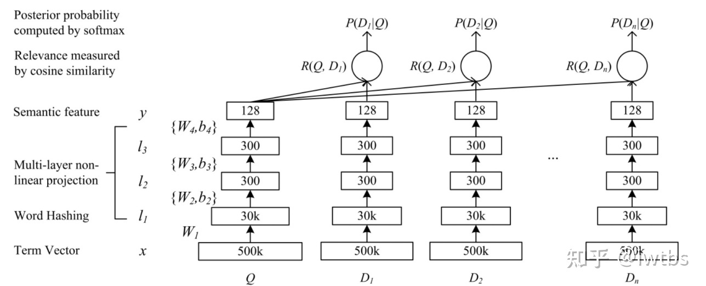
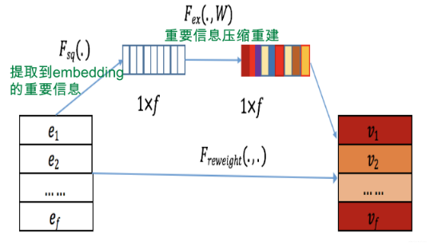

# TASK3: 召回模型

## 双塔召回模型

双塔模型在推荐领域是一个十分经典的模型，其优势在于在线预估时的低延时以及不高的训练开销，但是由于user和item塔互不交叉，使得模型无法考虑到user侧和item侧的之间的特征交叉，因此有很多工作尝试了调整经典双塔模型结构。在这里我们会从双塔模型的演变开始，一一做介绍。

### 经典双塔模型（DSSM）

DSSM由微软研究院在2013年提出，主要用来解决NLP领域中语义相似度任务，主要idea在于利用深度神经网络将文本表示为**低维度的向量**，提升搜索场景下文档和query的匹配度。

1. 模型原理：将用户搜索行为中的query和doc日志的内容，各自通过一个深度神经网络将输入的query和doc映射到同维度的语义空间中（即通过深度网络将信息压缩成两个同维度的embedding），然后通过计算两个embedding（语义向量）的余弦相似度来得到语义相似度，从而训练得到隐含语义的模型（包括query侧特征的embedding，doc侧特征的embedding，语句的低维语义向量表达sentence embedding）

2. 模型结构如下:

网络整体由n个DNN组成（每个DNN可以看做一个“塔”），Q代表搜索Query，D代表doc。我们先将搜索的文本query和要匹配的文本doc的embedding输入网络，经过三层隐藏层输出为128维的向量，然后将query和doc的若干输出两两算余弦相似度，看做是query和document之间的相似分数，最后进softmax输出概率。

介绍完了模型架构，进一步思考一下为什么这个可以用在推荐系统上呢？

在nlp运用中是匹配query和doc，那么改成匹配user和item就变成推荐场景了。因为只有user和item端，所以只需要构建两个塔，然后将输出的embedding计算相似度就可以了，结构如下：

3. 损失函数：

   在召回场景下，这种行为被视为是多分类问题，损失函数需要计算每个类的概率值：
   $$
   P(y|x;\theta)=\frac{e^{s(x,y)}}{\sum_{j\in[m]}e^{s(x,y_j)}}
   $$
   其中$s(x,y)$表示向量x，y间的相似度，M为物料库中所有商品

4. 总结：

   优势：速度很快，能够离线存放embedding，需要算分数的时候直接计算内积即可

   缺点：会牺牲模型部分的精确性。因为user侧和item侧的特征交互只会在最后的内积计算中发生，这会导致很多有用的信息在经过DNN时已经被其它的特征所模糊了。而在精排模型中user侧和item侧的特征在第一层mlp层就有交互

那下面我们来看看有哪些改进方案。

## SENet双塔模型

相关博客：https://zhuanlan.zhihu.com/p/358779957

SENet由Momenta在2017年提出，当时是一种应用于图像处理的新型网络结构。后来张俊林大佬将SENet引入了精排模型FiBiNET中，其作用是为了将大量长尾的低频特征抛弃，弱化不靠谱低频特征embedding的负面影响，强化高频特征的重要作用。先带着这样一个问题思考：网络是如何产生特征筛选的作用的呢（我自己的思路：给特征加个权重，类似attention的思想），让我们看看senet是怎么操作的。

主要分成三步：Squeeze, Excitation, Re-weight：

- Squeeze：先压缩特征信息，假设我们有f个特征，每个特征的embedding向量是k维，我们通过求均值的方式压缩特征信息，最终输出1*f的向量Z
- Excitation：在excitation阶段，引入了中间层比较窄的两层MLP网络，作用在压缩层输出的向量Z上。目的是在mlp中让特征进行交互，其中第一层mlp作用是特征交叉，第二层mlp的作用是保持输出大小维度，然后把第二层输出的f维向量看做是原来f个特征的权重。权重越大说明网络判断这个特征在当前输入组合里越重要。（实际上还是attention的思想）
- Reweight：把权重乘上原来的特征完成加权操作

说完了Senet模块，我们看看张俊林大佬是如何将Senet应用到双塔模型中的：

很简单，在feature embedding后加入senet模块让网络自己筛选特征的重要性即可

关于SENet双塔模型有效的原因，张俊林老师的解释是：双塔模型的问题在于User侧特征和Item侧特征交互太晚，在高层交互，会造成细节信息，也就是具体特征信息的损失，影响两侧特征交叉的效果。而SENet模块在最底层就进行了特征的过滤，**使得很多无效低频特征即使被过滤掉，这样更多有用的信息被保留到了双塔的最高层**，使得两侧的交叉效果很好；同时由于SENet模块选择出更加重要的信息，使得User侧和Item侧特征之间的交互表达方面增强了DNN双塔的能力。

因此SENet双塔模型主要是从特征选择的角度，提高了两侧特征交叉的有效性，减少了噪音对有效信息的干扰，进而提高了双塔模型的效果。此外，除了这样的方式，还可以通过增加通道的方式来增强两侧的信息交互。即对于user和item两侧不仅仅使用一个DNN结构，而是可以通过不同结构(如FM，DCN等)来建模user和item的自身特征交叉，例如下图所示：

这样对于user和item侧会得到多个embedding，类似于多兴趣的概念。通过得到的多个user和item的embedding，然后分别计算余弦值再相加(两侧的Embedding维度需要对齐)，进而增加了双塔两侧的信息交互。而这种方法在腾讯进行过尝试，他们提出的“并联”双塔就是按照这样的思路。
