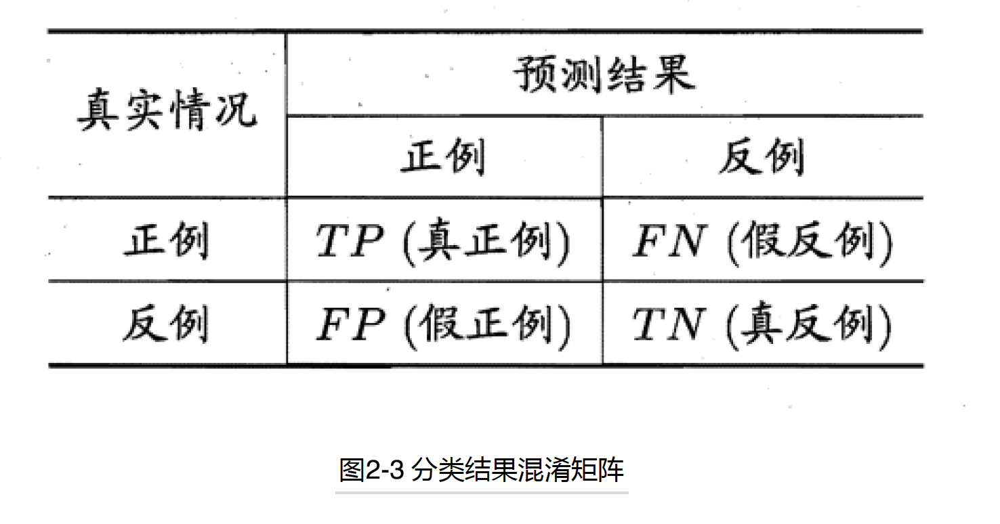
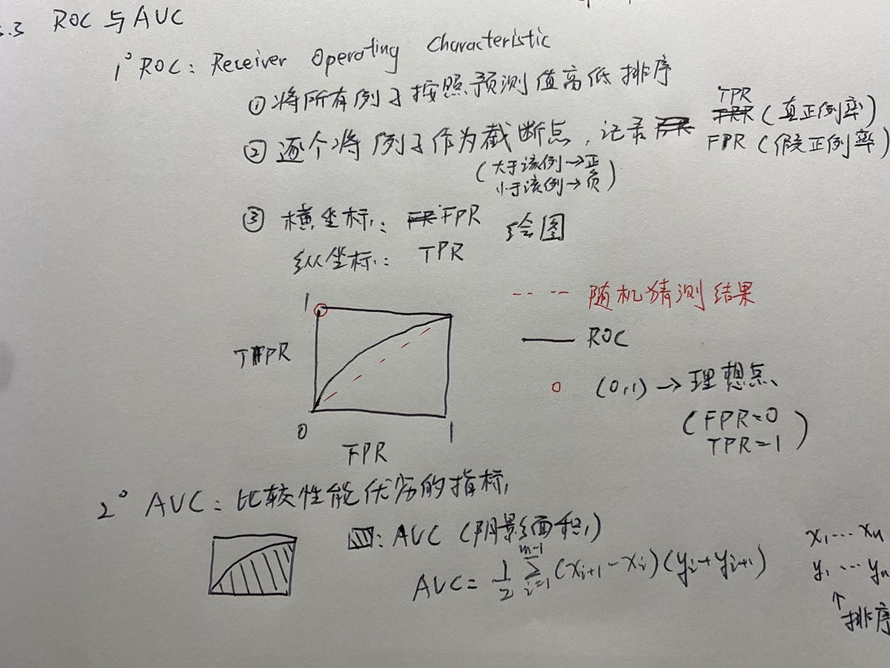

第二章：模型评估与选择

## 2.1 经验误差与过拟合

1. 一些概念

- 错误率： $E=a/m$ 。假设在m个样本中有a个分类错误

- 精度：$1-E$
- 误差 error：预测输出与样本真实输出的差别
- 训练误差 training error: 学习器在训练集上的误差
- 泛化误差 generalization error：学习器在新样本上的误差
- 过拟合：学习器过度拟合了噪声等因素反而造成了泛化性能下降
- 欠拟合：学习器连样本的一般性质都未学好

## 2.2 评估方法

1. 划分测试/训练集

   ### 2.2.1 留出法

   - 直接将测试集划分为两个互斥的集合，作为训练/验证集
   - 注意：尽可能保证数据分布一致（分层采样）
   - 常见做法：2/3 ～ 4/5 的样本用作训练，剩下的用做验证

   ### 2.2.2 交叉验证法（cross validation）

   - K折交叉验证：每次将数据集划分为k个集合，每轮取不同的k-1个子集的并集作为训练集，余下的为测试集训练。总共训练k轮，返回k个测试结果的验证方式
   - 通常取10折交叉验证
   - 特例：留一法
   - 交叉验证缺点：实际评估的模型使用的训练集会变少，会引入一些样本带来的偏差

   ### 2.2.3 自助法（bootstrapping）

   - 使用自助法的目的：减少训练样本规模不同造成的影响，同时高效地进行实验估计

   - 自助法流程：随机挑选一个样本，拷贝放入训练集，然后放回样本。重复m次。当m趋近无穷时，约有36.8%的未出现在测试集中。
   - 自助法在数据集较小，难以有效划分测试/训练集时效果好
   - 自助集会改变初始数据集的分布，因此样本量足够时还是采用交叉验证

## 2.3 性能度量

### 2.3.1 错误率与精度

- 分类错误率： 
  $$
  E(f;D)=\frac{1}{m}\sum_{i=1}^{m}I(f(x_i)\neq y_i)
  $$

- 精度：
  $$
  acc(f;D)  = \frac{1}{m}\sum_{i=1}^{m}I(f(x_i)=y_i)
  $$

### 2.3.2 查准率，查全率与F1

-  混淆矩阵

  错误率与精度虽然常见，但是往往会有更大的需求，例如：在信息检索中，我们会比较关注顾客有多少信息被检索出来，这时候我们需要知道学习器的查全率。或者我们关心检索出的信息有多少是顾客喜欢的，这时候查准率就比较重要。对于二分类问题，我们可以分别划分出真正例，假正例，真反例，假反例四种情况，具体如下

  

  - 查准率（Precision）定义：
    $$
    P = \frac{TP}{TP+FP}
    $$

  - 查全率/召回率 (Recall)定义：
    $$
    R = \frac{TP}{TP+FN}
    $$

  - P-R 曲线：我们可以通过查准查全率来做一条pr线来评估学习器的性能：

    

### 2.3.3 ROC和AUC

- 引入ROC和AUC的目的：

  （1）一般在分类时，我们同时还关注分类的阈值会对性能产生怎样的影响

  （2）PR曲线一般绘制难度会比较大

- ROC的绘制方法：

  （1）将所有样本按照预测值从高到低排列

  （2） 逐个将例子作为截断点，记录TPR和FPR

  （3） 将TPR做为横坐标，FPR作为纵坐标绘图

  如此，我们能够直观的看到分类器的性能以及各个阈值产生的影响

  