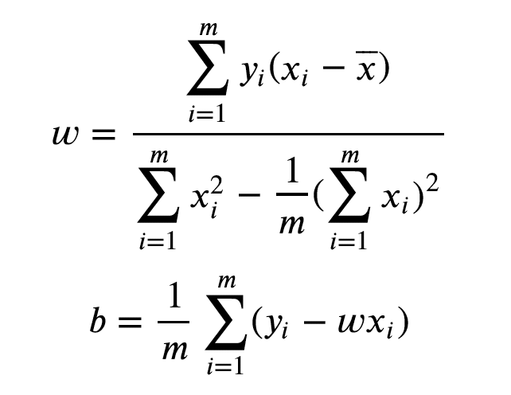
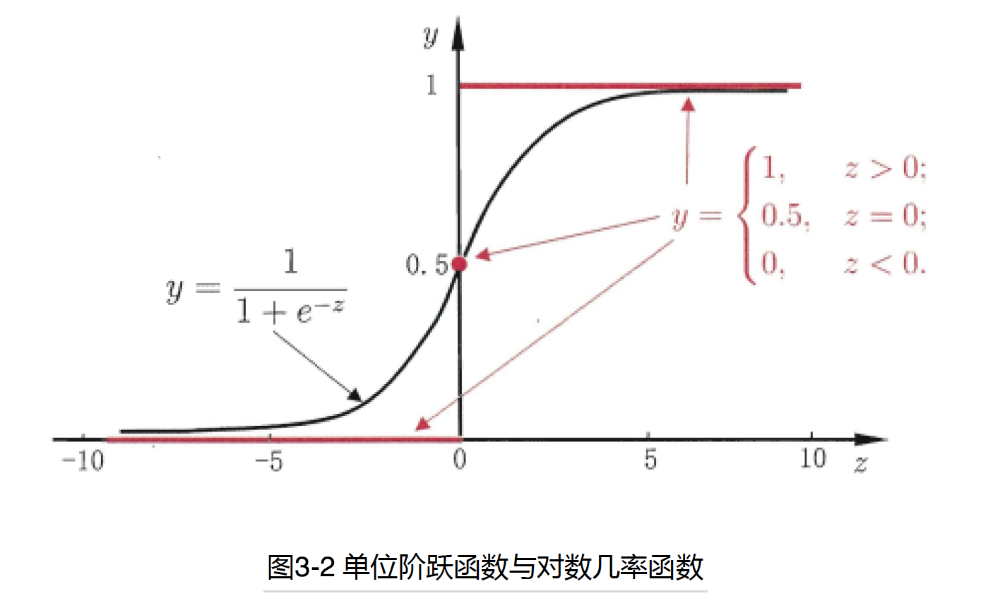
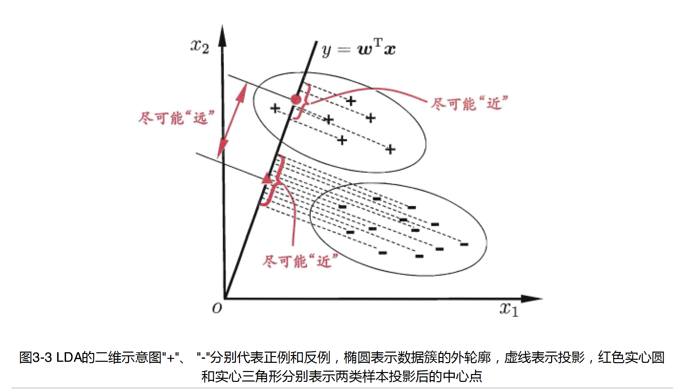

# 第三章 线性模型

## 3.1 基本形式

- 输入：d个属性描述的示例： $x = (x_1;x_2;\cdots;x_d)$

  线性模型试图学习一个通过示例的线性组合来进行预测的函数，即：
  $$
  f(x) = w_1x_1 + w_2x_2 + \cdots + w_dx_d +b
  $$
  向量形式：
  $$
  f(x) = w^Tx + b
  $$

- 在线性模型中，由于我们求得的系数$w$能够直观的表达各个属性在预测中的重要性，线性模型往往具有很好的可解释性。我们将在下文主要讨论一些经典的线性模型。

## 3.2 线性回归

### 3.2.1 一元线性回归

1. 目的：我们试图学得一个如下的线性模型用于尽可能准确地预估新样本的值
   $$
   f(x) = wx_i + b
   $$
   其中$x_i = (x_{i1};x_{i2};\cdots;x_{id})$

2. 处理输入值：

   (1)  连续值：一般能够直接使用

   (2)  离散值：若是值之间存在‘序关系’，即离散值之间存在大小关系。我们可以把它转换成连续值。如‘高’，‘中’，‘矮’，我们就可以转坏为{0.0, 0.5, 1.0}三个值。若是值之间不存在大小关系，对于k个属性值，我们通常会将它转化成k维向量，例如根据瓜的种类，我们可以转化为(0, 0, 1), (0, 1, 0), (0, 0, 1)三种。

3. 在一维属性下构建模型：

   这时我需要求得的模型长下面这个样子：
   $$
   f(x) = wx_i + b
   $$
   如何确定$w$和$b$呢？我们可以通过使损失函数最小化来达到这个目的

   - 均方误差损失函数介绍:
     $$
     E_{(w,b)} = \sum_{i=1}^{m}(f(x_i)-y_i)^2
     $$
     其中$f(x|w,b)$对应的是我们创建模型，这个模型和$w,b$相关，$y_i$指每个属性对应的标签值

     为什么损失函数长这个样子？首先要估计误差。想到算$f(x)-y_i$是很自然的，但是这个式子并不是处处可导，因此我们加一个平方让它处处可导。然后把每个新样本预测的误差累加起来就得到了最后的误差函数。

   均方误差有非常好的集合意义，对应的是每个点到我们预测的模型的Euclidean distance。基于均方误差最小化来进行模型求解的方法称为最小二乘法。

   我们知道关于凸函数的求最值问题就是分别让函数的偏导等于0。这里我们先证明这个损失函数是凸函数：

   - 引入一个新概念：凸集：

     设集合$D \subset R^n$，如果对任意的$x,y\in  D$与任意的$\alpha \in [0,1]$，有：
     $$
     \alpha x + (1-\alpha )y \in D
     $$
     则称集合D是凸集。

     几何意义：若两个点属于此集合，则这两个点连线上的任意一点均属于此集合。常见的凸集合：$\emptyset$ ，$R^n$

   - 然后凸函数：

     设D为非空凸集，$f$是定义在D上的函数，如果对于任意的$x_1,x_2 \in D, \alpha \in (0,1)$，均有
     $$
     f(\alpha x_1+ (1-\alpha )x_2) \leqslant \alpha f(x_1) + (1-\alpha )f(x_2)
     $$
     则称$f$为D上的凸函数

     几何理解：函数上取两点两点连线，线上的点一定比同x位置上的函数值大

   - 判定凸函数定理：

     定理：设$D \subset R^n$是非空开凸集，$f:D \subset R^n \to R$，且$f(x)$在D上二阶连续可微，如果$f(x)$的hessain矩阵在D上是半正定的（positive semidefinite)，则f(x)是D上的凸函数

     因此，我们只需证明$E_{(w,b)}$的Hessain矩阵：
     $$
     \nabla^2E_{(w,b)}
     $$
     是半正定的即可

     证明过程：

     

   证明了损失函数为凸函数后，我们只需让他们的偏导等于0即可得到最优解。

   

4. 一些tips: 关于学习机器学习，最好建立下面这样的层次化认知

   - 模型：根据具体问题，确定假设空间与模型

   - 策略：根据评价标准，选取最优的模型策略以及损失函数

   - 算法：求解损失函数，确定最优模型。注意有些时候不一定会有闭式解(closed-form solution)

     

### 3.2.2 多元线性回归

1.标准形式：我们这里假定有多元变量$(x_1,x_2,\cdots,x_n)$, 我们最后试图学得：
$$
f(x_i) = Xw+b
$$
其中：
$$
X = \left(\begin{array}{cols} x_1^T\ 1\\x_2^T\ 1\\\cdots \\x_m^T\ 1 \end{array}\right),\ \ \  w为系数矩阵
$$
损失函数为:
$$
E = (y-Xw)^T(y-Xw)
$$

2. 最小化损失函数：

   要使损失函数最小，同样我们需要先证明E是凸函数，然后通过令导数等于0就可以求出最优解。推导过程如下：

3. 关于假设：

   从求解过程中不难发现，最小二乘法能解出唯一解的充分条件是X为满秩矩阵，即数据个数比标签个数多1，但是往往这种情况并不能满足。这个时候会解出多个能使损失函数最小的$w$（比如解方程组时会有多组解），常见的解决方法是引入正则化项，让模型针对归纳偏好作出选择。

4. 广义线性回归：

   通常我们还可以将线性模型的一般形式推广到x与y为非线性映射的情况，比如将y取对数处理等。这时候我们会得到广义线性模型：
   $$
   y=g^{-1}(w^Tx+b)
   $$
   其中$g(x)$需单调可导充分光滑。广义线性模型的估计通常会通过加权最小二乘法或者极大似然法进行估计

## 3.3 对数几率回归 (Logistic Regression)

1. 目的：之前的线性回归通常只是用在回归任务，如果我们需要通过线性模型做分类任务应该怎么办呢

2. 做法：通过对数几率函数(logistic function的特殊形式)，或者Heaviside函数来将实值转换为概率或者0/1值。注意Heavisde函数并不光滑，因此一般会用对数几率函数

   

   带入这个函数，我们能够得到：
   $$
   y=\frac{1}{1+e^{-(w^Tx+b)}}
   $$
   化简得到一般形式
   $$
   ln(\frac{y}{1-y}) = w^Tx +b
   $$
   其中 $y,1-y$ 分别代表样本$x$是正，反例的可能性，$\frac{y}{1-y}$ 被称为‘几率’(odds)

3. 极大似然求解

   由于最终的 $y$ 取离散值 $\{0,1\}$ ，我们令大于0.5的 $y$ 取1，小于0.5的取0，即：
   $$
   P(y=1|x) = \frac{1}{1+e^{-(w^Tx+b)}}=\frac{e^{(w^Tx+b)}}{1+e^{(w^Tx+b)}}
   $$

   $$
   P(y=0|x) =1- \frac{1}{1+e^{-(w^Tx+b)}}=\frac{1}{1+e^{(w^Tx+b)}}
   $$

   令 $w^Tx+b$ 为一般形式 $\beta^T\hat{x}$ ，$\beta = (w;b),\hat{x}=(x;1)$ ，化简得
   $$
   P(y=1|\ \hat{x};\beta) =\frac{e^{(\beta^T\hat{x})}}{1+e^{(\beta^T\hat{x})}}
   $$

   $$
   P(y=0|\ \hat{x};\beta) =\frac{1}{1+e^{(\beta^T\hat{x})}}
   $$

   整体的probability mass function:
   $$
   P(y|\ \hat{x};\beta) =y\cdot\frac{e^{(\beta^T\hat{x})}}{1+e^{(\beta^T\hat{x})}}+(1-y)\cdot\frac{1}{1+e^{(\beta^T\hat{x})}}
   $$
   然后我们用最大似然求解：

   

   我们最终需要最小化损失函数 $l(\beta)$ ，这个 $l(\beta)$ 本质上是一个交叉信息熵，我们想要

   使模拟分布和理想的分布的交叉信息熵最小（即两种情况的不确定性最小）。同样以似然角度来理解，根据已有的数据 $x$ ，我们需要求得 $w$ 使得这个 $x$ 出现的可能性 (likelihood) 最大。

   幸运的是，这个函数是一个可导连续凸函数，因此常规的优化方法如梯度下降(gradiant descent)和牛顿法(Newton method)都可以对其优化得到最优解。注意这里是没有闭式解的，只能通过迭代求得近似解

   

   ## 3.4 线性判别分析 ( Linear Discriminat Analysis ) or ( Fisher Discriminat Analysis)

   1. 基本思想：将sample投影到一条直线上，使同类sample的投影点尽可能接近，异类sample 的投影点尽可能远离

      

   2. 求解策略：

      先定义：$X_i$  为sample的集合

      $\mu_i$ 为smaple的均值向量

      $\sum_i$ 为smaple的协方差矩阵

      若将数据投影到直线 $w$ 上，则两类样本的中心在直线上的投影分别为 $w^T\mu_0$ 和 $w^T\mu_1$; 若将所有样本点都投影到直线上，则两类样本的协方差为 $w^T\sum_0w$ 和 $w^T\sum_1w$ ，由于直线是一维空间，则所有量均为实数。

      想要达成同类样本尽可能近，异类样本尽可能远，即满足：各类协方差之和$w^T\sum_0w+w^T\sum_1w$尽可能小，不同类的中心距离$\|w^T\mu_0-w^T\mu_1\|$尽可能大。因此定义了以下矩阵

      1） 类内散度矩阵（越小越好）
      $$
      S_w=\sum_0+\sum_1=\sum_{x\in X_0}(x-\mu_0)(x-\mu_0)^T + \sum_{x\in X_1}(x-\mu_1)(x-\mu_1)^T
      $$
      2） 类间散度矩阵（越大越好）
      $$
      S_b = (\mu_0-\mu_1)(\mu_0-\mu_1)^T
      $$
      将二者结合得到了最终的最大化目标：广义瑞利商（generalized Rayleigh quetient）：
      $$
      J = \frac{w^TS_bw}{w^TS_ww}
      $$
      

   

